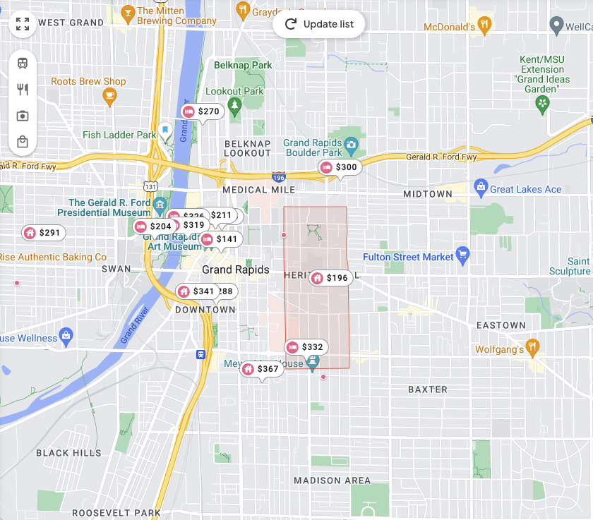

# H1
## H2
### H3

**bold text**
*italicized text*
~~Strike through~~
==Highlight==
This~subscripts~Words
This^superscripts^Words
Adding emojis :joy:


> block quote:
> This is the Loreum Ipsum stuff that noone reads

1. List
2. with
3. Order

- List
- without
- order

`System.out.println("Code");`

Horizontal Rule (Interesting, it makes it a H2)
---

[link](https://www.google.com)



|Table | And stuff|
|Item 1 | asdf |
|Item 2 | asdf2 |

```
FencedCode = 
{
    "this" : "is a JSON",
    "this2" : "is more JSON"
}
```

Adding footnotes are easy too. [^1]
[^1]: Match it with the right number.

### Heading ID {#Im-not-sure-what-this-is}

Lets define
: This is the definition

- [] Add some tasks
- [] Add more tasks
- [] Tell me when done